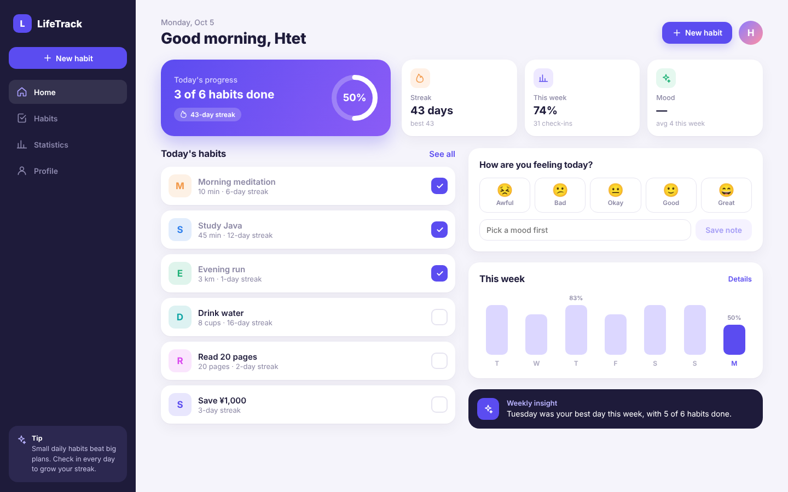

# LifeTrack

A habit and mood tracker for students and young workers. Sign up, create habits, check them off every day, log your mood (1–5 with a short note), and see your weekly progress. Works on phone, tablet and laptop.

**Tech stack:** React 18 + Vite (frontend) · Java 21 + Spring Boot 3.5 (backend) · Spring Security with JWT · Spring Data JPA · H2 (local) / PostgreSQL (deploy)



## Features

- **Sign up / sign in** with email and password. Passwords are hashed with BCrypt, and sessions use JWT tokens.
- **Habits:** create, edit and delete habits with a category, color and goal. Check them off for today or for past days.
- **Streaks:** per habit and overall, plus a 7-day history for each habit.
- **Mood:** log how you feel each day (1–5) with an optional note.
- **Statistics:** weekly completion chart, comparison with the previous week, average mood and an automatic weekly insight.
- **Profile:** achievements, a check-in heatmap, dark mode, data export (JSON) and sign out.
- **Responsive layout:** bottom navigation on phones, an icon sidebar on tablets and a full sidebar on laptops.

## Project structure

```
lifetrack/
├── backend/                  Spring Boot REST API (Java 21)
│   ├── pom.xml
│   └── src/main/java/com/lifetrack/
│       ├── auth/             sign up, sign in, current user
│       ├── config/           security, JWT, CORS
│       ├── habit/            habits, daily check-ins, streaks
│       ├── mood/             daily mood entries
│       ├── stats/            weekly stats, summary, heatmap
│       ├── user/             user entity
│       └── common/           error handling, React page routing
├── frontend/                 React app (Vite)
│   ├── src/pages/            SignIn, SignUp, Home, Habits, Stats, Me
│   ├── src/components/       layout, habit form, mood card, charts
│   └── mock-server.mjs       stand-in API for trying the UI without Java
└── docs/screenshots/
```

## Run it on your PC

### 1. Install the tools (one time)

- **JDK 21**, for example Eclipse Temurin 21 from adoptium.net
- **Node.js 20 or newer** from nodejs.org
- **IntelliJ IDEA Community Edition** (free, recommended). It includes Maven, so you don't need to install Maven separately.

### 2. Start the backend (port 8080)

**With IntelliJ:** choose File → Open, select the `backend` folder and wait for Maven to download the libraries (the first time takes a few minutes). Then open `LifeTrackApplication.java` and click the green ▶ button.

**With the terminal (if you have Maven installed):**

```bash
cd backend
mvn spring-boot:run
```

When you see `Started LifeTrackApplication`, the API is ready at http://localhost:8080. Data is saved in `backend/data/`.

### 3. Start the frontend (port 5173)

Open a second terminal:

```bash
cd frontend
npm install
npm run dev
```

Open **http://localhost:5173** and create an account.

### Try the UI without Java

To see the app before setting up Java, start the stand-in API instead of the backend. It has the same endpoints but keeps data in memory only:

```bash
cd frontend
npm run mock -- --demo     # terminal 1: demo user with 6 weeks of history
npm run dev                # terminal 2
```

Sign in with **demo@lifetrack.app / password123**.

## Tests

```bash
cd backend
mvn test
```

`ApiFlowTest` runs the main journey against the real API with an in-memory database: sign up, duplicate email, wrong password, create a habit, check it off, log a mood, and read the stats.

## Build one runnable file

This bundles the React app inside the Spring Boot jar, so a single command serves everything on port 8080:

```bash
cd frontend && npm run build:backend
cd ../backend && mvn package
java -jar target/lifetrack-backend-0.1.0.jar
```

Then open http://localhost:8080.

## API

All endpoints except sign up and sign in need the header `Authorization: Bearer <token>`. Dates are the user's local date (`YYYY-MM-DD`), so "today" follows the user's time zone.

| Method | Path | Description |
|---|---|---|
| POST | `/api/auth/signup` | Create an account → `{ token, user }` |
| POST | `/api/auth/signin` | Sign in → `{ token, user }` |
| GET | `/api/auth/me` | Current user |
| GET | `/api/habits?date=` | Habits with done today, 7-day history and streak |
| POST | `/api/habits?date=` | Create a habit `{ name, category, color, goal }` |
| PUT | `/api/habits/{id}?date=` | Update a habit |
| DELETE | `/api/habits/{id}` | Delete a habit and its check-ins |
| POST | `/api/habits/{id}/toggle?date=` | Check off or un-check a habit for that day |
| GET | `/api/mood?from=&to=` | Mood entries in a date range |
| PUT | `/api/mood` | Save the mood for a day `{ date, score 1–5, note }` |
| GET | `/api/stats/weekly?date=` | 7-day completion, previous week, average mood |
| GET | `/api/stats/summary?date=` | Current and longest streak, totals |
| GET | `/api/stats/heatmap?date=&weeks=` | Check-ins per day |

Errors come back as `{ "message": "...", "fields": { "email": "..." } }`.

## Deploying

Run with the `prod` profile and set these environment variables:

| Variable | Example |
|---|---|
| `SPRING_PROFILES_ACTIVE` | `prod` |
| `DATABASE_URL` | `jdbc:postgresql://host:5432/lifetrack` |
| `DATABASE_USERNAME` / `DATABASE_PASSWORD` | your database login |
| `LIFETRACK_JWT_SECRET` | a random string of at least 32 characters |

Hosts such as Render or Railway can run the single jar from "Build one runnable file" with a free PostgreSQL database.

## Ideas for next steps

- Reminders (email or browser notifications)
- Japanese language option (日本語)
- Password reset by email
- Monthly and yearly statistics
